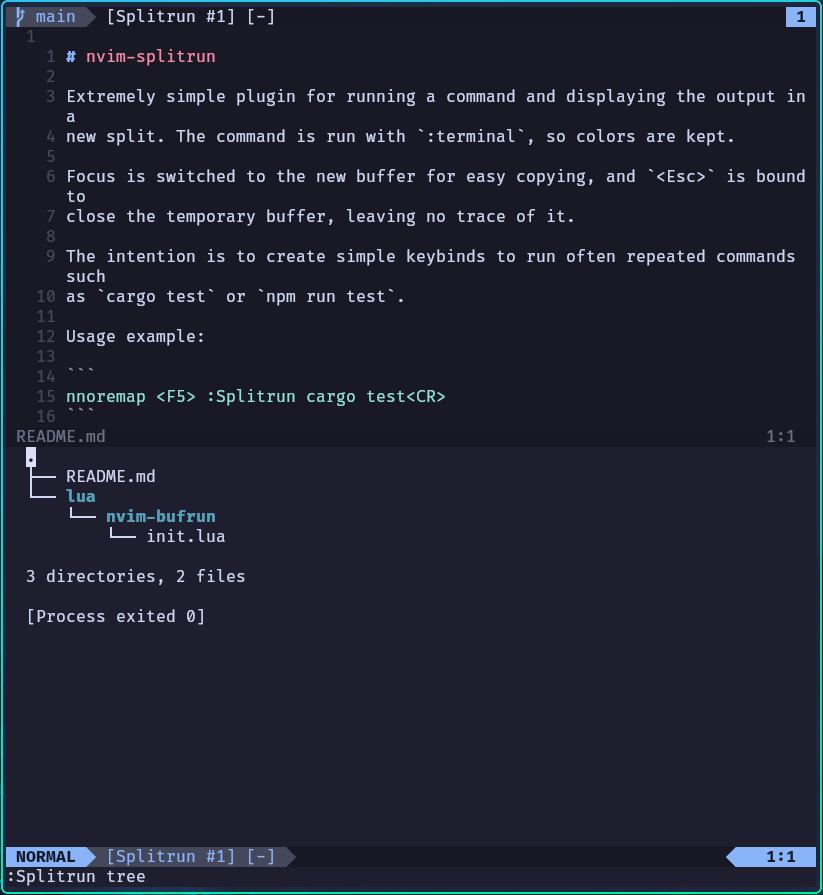

# nvim-splitrun

The super simple command runner plugin I've always wanted.



Usage example:

```
nnoremap <F5> :Splitrun cargo test<CR>
```

Runs a command and displays the output in a scratch buffer in a new split. The
split direction is automatically selected based on where you have the most
room.

Subsequent executions reuse the same split if it's still open, but you can
choose to always create new splits by using `:SplitrunNew` instead.

The command is run with `:terminal`, so terminal colors work as you would
expect.

Keyboard focus is moved to the new window for convenient scrolling and yanking.
The `<Esc>` key is automatically bound to close the split, leaving no trace of
the temporary buffer.

The intention is to create simple keybinds to run often repeated commands such
as `cargo test` or `npm run test`.

## Installation

Installs like any other Neovim plugin.

Example installation with Lazy:

```lua
{
  "Hubro/nvim-splitrun",
  opts = {},
},
```
